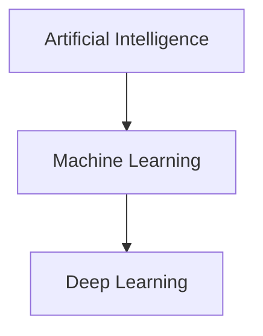
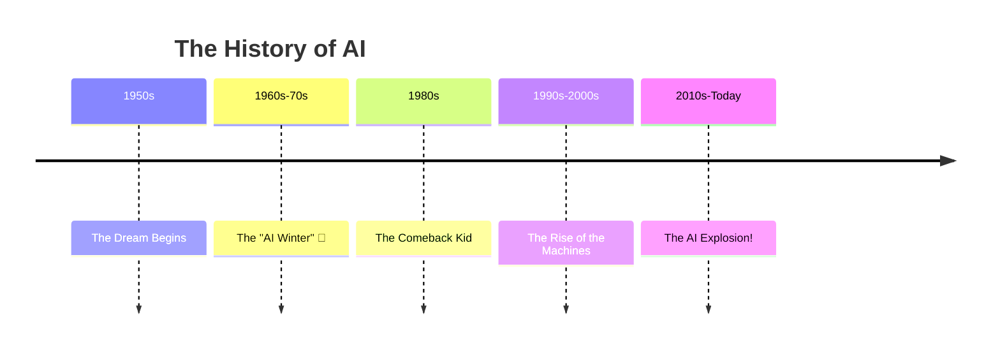

# Lesson 1: Your Secret Guide to Artificial Intelligence! 🤖

Hey there, future tech genius! 

Ever wondered how YouTube seems to know *exactly* what video you want to watch next? Or how Snapchat puts those funny filters on your face? It's not magic, it's something even cooler: **Artificial Intelligence**, or **AI** for short.

Welcome to your very first lesson where we'll uncover the secrets of AI, Machine Learning (ML), and Deep Learning (DL). We're going to skip the super-boring math and get straight to the fun, powerful ideas that are changing the world.

---

## Part 1: The Big Picture - What is this AI Magic?

Imagine you have a set of Russian nesting dolls. You know, those wooden dolls that have smaller dolls inside them? AI, ML, and DL are kind of like that!

*   **Artificial Intelligence (AI)** is the biggest doll. It's the whole grand idea of making machines smart. This could be anything from a chess-playing computer to a robot that can have a conversation with you. If a machine is doing something that would normally require a human brain—like learning, reasoning, or problem-solving—that's AI!

*   **Machine Learning (ML)** is the next doll inside. This is where things get really interesting. Instead of giving the machine a giant list of rules for every single situation, we let it *learn* on its own! We feed it a ton of information, which we call **data**, and it starts to figure out the patterns. It's like how you learn to ride a bike. You don't read a manual; you just keep trying, and your brain figures it out. For a computer, data is its experience!

*   **Deep Learning (DL)** is the smallest, most powerful doll. This is a super-special kind of machine learning that's inspired by the human brain. It's amazing at finding very tricky patterns in huge amounts of data. It's the secret sauce behind things like self-driving cars recognizing pedestrians, or voice assistants like Siri and Alexa understanding what you say.

Here's a little diagram to help you remember:

**Real-World Examples:**
*   **AI:** A character in a video game that cleverly finds its way around obstacles to reach you.

*   **ML:** Your email inbox automatically sorting emails into "spam" and "not spam" based on thousands of examples it has seen before.

*   **DL:** A website that can look at a picture of a dog and tell you what breed it is, even if it's never seen that specific dog before!

---

## Part 2: A Blast from the Past - The Secret History of Smart Machines

You might think AI is a new thing, but people have been dreaming about smart machines for a *long* time. Let's hop in our time machine!

Story begins here:
- 1950s : The Dream Begins

    - Alan Turing, a hero who helped crack secret codes in World War II (enigma machine), asks the big question: "Can machines think?"

    - The term "Artificial Intelligence" is born at a summer workshop where a bunch of brilliant scientists decided to make it a real field of study.

- 1960s-70s : The "AI Winter" 🥶

    - Early excitement was huge! Researchers made bold promises, but computers back then were as powerful as a modern calculator. They just couldn't handle the big ideas.

    - When the progress was slow, people got disappointed, and funding for research dried up. It was a sad, chilly time for our robot friends.

- 1980s : The Comeback Kid

    - A new type of AI called "expert systems" gets popular. These were programs designed to be experts in one specific thing, like diagnosing diseases or finding oil.

- 1990s-2000s : The Rise of the Machines (in a good way!)

    - Computers get way, way more powerful.

    - In 1997, a computer named Deep Blue beats the world chess champion, Garry Kasparov! This was a huge moment. 🤯

- 2010s-Today : The AI Explosion!

    - Thanks to even more powerful computers and tons of data from the internet, Deep Learning takes over!
    
    - This leads to the amazing AI we see today: self-driving cars, voice assistants, and AI that can create stunning art and music!

**Funny Story Time:** In 1952, a computer scientist named Arthur Samuel created a checkers program that could learn from its own mistakes. After playing thousands of games against itself, it eventually became better than its creator! Arthur Samuel said it was "a very humbling experience." It was one of the first examples of a machine truly learning.

---

## Part 3: Your First Adventure in Machine Learning - The Case of the Pizza-Loving Student

Okay, enough history. Let's get our hands dirty with a real machine learning problem!

**The Mission:** We need to build a model that can predict if a new student will like pizza. 🍕

**The Clues (Our Data):** We have some information about other students. This is our **training data**. In machine learning, the clues we use to make a prediction are called **features**, and the thing we're trying to predict is called the **label**.

| Student | Likes Video Games? (Feature 1) | Likes Superheroes? (Feature 2) | Likes Pizza? (Label) |
|---|---|---|---|
| Alex | Yes | Yes | Yes |
| Ben | No | Yes | Yes |
| Chloe | Yes | No | Yes |
| David | No | No | No |
| Emily | Yes | Yes | Yes |

**The Detective Work (Building a Model):** Now, we need to find a pattern. Looking at the table, what do you notice?

It seems like if a student likes video games OR superheroes, they probably like pizza. That's our **model**! It's a simple rule that our machine can use to make predictions.

**The Test (Is Our Model Any Good?):** A new student, Frank, arrives. He loves video games but isn't a big fan of superheroes.

*   **Our Model:** If a student likes video games OR superheroes, they will like pizza.
*   **Frank's Features:** He likes video games.
*   **Prediction:** Frank will like pizza!

But wait! Another new student, Grace, arrives. She doesn't like video games or superheroes.

*   **Our Model:** If a student likes video games OR superheroes, they will like pizza.
*   **Grace's Features:** She doesn't like video games or superheroes.
*   **Prediction:** Grace will *not* like pizza.

Let's say we ask Grace, and she says she *loves* pizza! Our model was wrong! And that's one of the most important lessons in machine learning: **models are not perfect**. They are just our best guess based on the data we have. A big part of machine learning is testing our models and finding ways to make them better.

---

## Part 4: Let's Discuss!

Now it's your turn to be the AI expert. Think about these questions:

1.  Can you think of three things you use every day that might use AI? (Hint: think about your phone, your TV, and the internet!)
2.  If you could teach a robot to do any chore in your house, what would it be? What kind of "data" would you need to give it so it could learn?
3.  Our pizza model wasn't perfect. What other "features" (clues) could we collect about students to make our pizza predictions better?

---

**What's Next?**

You've taken a huge step into the amazing world of AI! You've learned the difference between AI, ML, and DL, traveled through history, and even built and tested your very own machine learning model.

Next time, we'll explore some of the different *types* of machine learning and start to see how a little bit of code can bring these ideas to life.

Stay curious!
