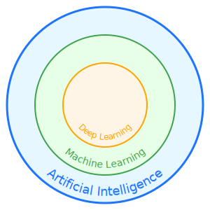
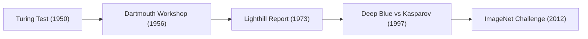

# Lesson 1: Your Secret Guide to Artificial Intelligence! 🤖

Hey there, future tech genius! 

Ever wondered how YouTube seems to know *exactly* what video you want to watch next? Or how video games have enemies that seem to think for themselves? It's not magic, it's something even cooler: **Artificial Intelligence**, or **AI** for short.

Welcome to your very first lesson where we'll uncover the secrets of AI, Machine Learning (ML), and Deep Learning (DL). We're going to skip the super-boring math and get straight to the fun, powerful ideas that are changing the world.

---

## Part 1: The Big Picture - What is this AI Magic?

Imagine you have a set of Russian nesting dolls. You know, those wooden dolls that have smaller dolls inside them? AI, ML, and DL are kind of like that!

*   **Artificial Intelligence (AI)** is the biggest, outermost doll. It's the whole grand idea of making machines smart. This could be anything from a simple calculator to a robot that can have a conversation with you. If a machine is doing something that would normally require a human brain—like learning, reasoning, or problem-solving—that's AI!

*   **Machine Learning (ML)** is the next doll inside. This is where things get really interesting. Instead of a programmer writing a giant list of rules for every single situation, we let the machine *learn* on its own! We feed it a ton of information, which we call **data**, and it starts to figure out the patterns. 

*   **Deep Learning (DL)** is the smallest, most powerful doll. This is a super-special kind of machine learning that's inspired by the human brain. It's amazing at finding very tricky patterns in huge amounts of data. It's the secret sauce behind things like self-driving cars recognizing pedestrians, or voice assistants like Siri and Alexa understanding what you say.

> **🧠 Learning Like a Human!**
>
> The way a machine "learns" from data is a lot like how you learned to ride a bike. No one gave you a perfect set of rules. You just tried, maybe you fell, and you adjusted. Your brain learned from the "data" of each attempt. Machine Learning is the same idea: learning from experience!

Here's a little diagram to help you remember:

**Real-World Examples:**

*   **AI:** A character in a video game that cleverly finds its way around obstacles to reach you.
*   **ML:** Your email inbox automatically sorting emails into "spam" and "not spam" based on thousands of examples it has seen before.
*   **DL:** A website that can look at a picture of a dog and tell you what breed it is, even if it's never seen that specific dog before!

---

## Part 2: A Journey Through Time - The History of AI

Artificial Intelligence isn't a recent invention; it's a field with a rich and fascinating history, marked by periods of great optimism and challenging setbacks. Understanding this journey helps us appreciate the technology we have today.

> **Historical Insight: The Mechanical Turk**
>
> In the 1770s, an automaton called "The Mechanical Turk" toured Europe, defeating skilled chess players. It was later revealed to be an elaborate illusion controlled by a hidden human master. While not true AI, it ignited public imagination about the possibility of intelligent machines.

The history of modern AI is often divided into several key periods:

*   **1950s: The Dawn of AI.** The field was formally established. Alan Turing's seminal paper proposed the "Turing Test" to measure machine intelligence, and the 1956 Dartmouth Summer Research Project on Artificial Intelligence coined the term "Artificial Intelligence" and set the research agenda for decades.

*   **1960s-1970s: The "AI Winter".** Initial enthusiasm led to bold predictions that were difficult to achieve with the limited computing power of the era. A lack of progress on complex problems led to reduced government funding and a period of slower research, often called the "AI Winter."

*   **1980s: The Rise of Expert Systems.** AI saw a resurgence with the commercial success of "expert systems." These programs captured the knowledge of human experts in a specific domain (like medical diagnosis or geology) to provide automated advice and solutions.

*   **1990s-2000s: The Growth of Machine Learning.** With the advent of more powerful computers and larger datasets, Machine Learning began to flourish. A landmark event was in 1997, when IBM's Deep Blue chess computer defeated world champion Garry Kasparov, demonstrating the power of computational brute force and advanced search algorithms.

*   **2010s-Present: The Deep Learning Revolution.** The current era is dominated by Deep Learning. Fueled by massive datasets (like ImageNet), powerful GPUs (Graphics Processing Units), and refined algorithms, AI has achieved breakthroughs in image recognition, natural language processing, and autonomous systems, making it a part of our daily lives.

**Funny Story Time:** In 1952, a computer scientist named Arthur Samuel created a checkers program that could learn from its own mistakes. After playing thousands of games against itself, it eventually became better than its creator! Arthur Samuel said it was "a very humbling experience." It was one of the first examples of a machine truly learning.

---

## Part 3: Your First Adventure in Machine Learning - The Case of the Pizza-Loving Student

Okay, enough history. Let's get our hands dirty with a real machine learning problem!

**The Mission:** We need to build a model that can predict if a new student will like pizza. 🍕

**The Clues (Our Data):** We have some information about other students. This is our **training data**. In machine learning, the clues we use to make a prediction are called **features**, and the thing we're trying to predict is called the **label**.

| Student | Likes Video Games? (Feature 1) | Likes Superheroes? (Feature 2) | Likes Pizza? (Label) |
|---|---|---|---|
| Alex | Yes | Yes | Yes |
| Ben | No | Yes | Yes |
| Chloe | Yes | No | Yes |
| David | No | No | No |
| Emily | Yes | Yes | Yes |

**The Detective Work (Building a Model):** Now, we need to find a pattern. Looking at the table, what do you notice?

It seems like if a student likes video games OR superheroes, they probably like pizza. That's our **model**! It's a simple rule that our machine can use to make predictions.

**The Test (Is Our Model Any Good?):** A new student, Frank, arrives. He loves video games but isn't a big fan of superheroes.

*   **Our Model:** If a student likes video games OR superheroes, they will like pizza.
*   **Frank's Features:** He likes video games.
*   **Prediction:** Frank will like pizza!

But wait! Another new student, Grace, arrives. She doesn't like video games or superheroes.

*   **Our Model:** If a student likes video games OR superheroes, they will like pizza.
*   **Grace's Features:** She doesn't like video games or superheroes.
*   **Prediction:** Grace will *not* like pizza.

Let's say we ask Grace, and she says she *loves* pizza! Our model was wrong! And that's one of the most important lessons in machine learning: **models are not perfect**. They are just our best guess based on the data we have. A big part of machine learning is testing our models and finding ways to make them better.

---

## Part 4: Let's Discuss!

Now it's your turn to be the AI expert. Think about these questions:

1.  Can you think of three things you use every day that might use AI? (Hint: think about your phone, your TV, and the internet!)
2.  If you could teach a robot to do any chore in your house, what would it be? What kind of "data" would you need to give it so it could learn?
3.  Our pizza model wasn't perfect. What other "features" (clues) could we collect about students to make our pizza predictions better?

---

**What's Next?**

You've taken a huge step into the amazing world of AI! You've learned the difference between AI, ML, and DL, traveled through history, and even built and tested your very own machine learning model.

Next time, we'll explore some of the different *types* of machine learning and start to see how a little bit of code can bring these ideas to life.

Stay curious!
