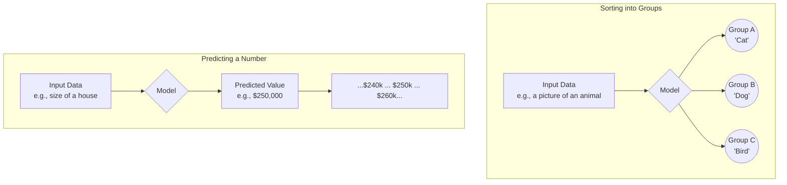
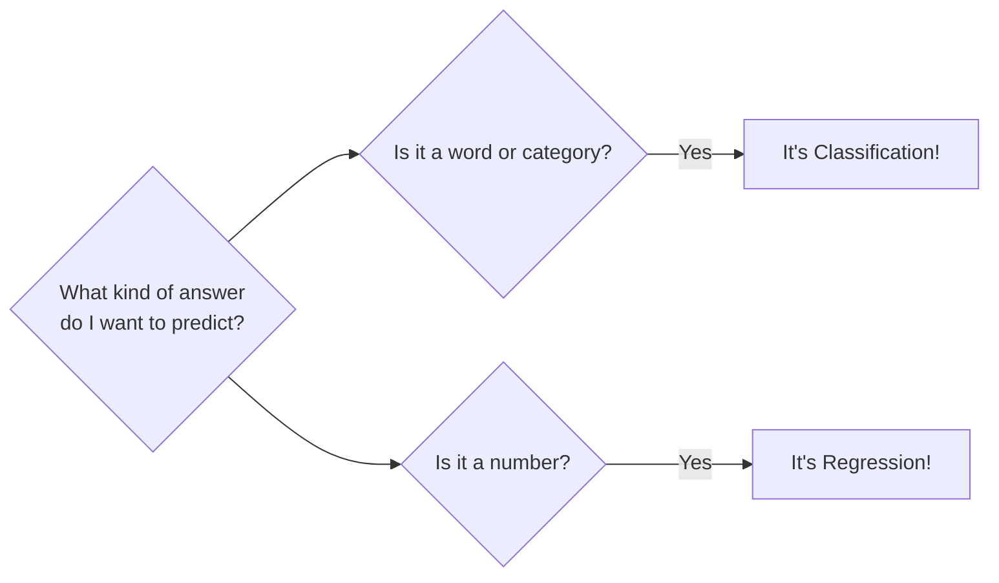

# Lesson 3: The Two Big Problems ML Can Solve! 🎯

Hello again, super-learner!

So far, we've learned what AI is and explored the three "flavors" of machine learning. We paid special attention to **Supervised Learning**, where we teach a computer using an answer key.

Today, we're going to zoom in on Supervised Learning and discover the two main types of problems it's really good at solving: **Classification** and **Regression**. It sounds fancy, but it's as simple as sorting laundry and guessing numbers!

---

## Part 1: Classification (The Sorter 🧺)

**Classification** is all about teaching a machine to sort things into groups or categories. The answer is always one of a few specific choices.

**The Analogy: Sorting Laundry**
Imagine you have a giant pile of laundry. Your job is to sort it into the right baskets: one for whites, one for colors, and one for darks. That's classification! You're assigning each piece of clothing to a specific category.

**The Big Idea:** The model predicts a **category** or a **class**.

**Real-World Examples:**
*   **Spam or Not Spam?** Your email uses classification to read an incoming email and decide: should it go in the "spam" basket or the "inbox" basket?
*   **Cat vs. Dog:** Our example from last lesson was a classic classification problem. The model looks at a picture and sorts it into the "cat" category or the "dog" category.
*   **Pizza Lover?:** Our very first model was also a classification model! It predicted whether a student belonged to the "likes pizza" group or the "doesn't like pizza" group.

---

## Part 2: Regression (The Guesser 🔢)

**Regression** is all about teaching a machine to predict a specific number or value. The answer can be any number within a range.

**The Analogy: Guessing Jellybeans**
Imagine a big jar full of jellybeans. If you try to guess *exactly* how many are inside, you're making a regression guess. Your answer isn't a category like "a lot" or "a little," but a specific number, like "852 jellybeans."

**The Big Idea:** The model predicts a **numerical value**.

**Real-World Examples:**

*   **Weather Forecast:** When your weather app says it will be 75°F tomorrow, that's a regression model at work. It's predicting a specific number on the temperature scale.

*   **Pizza Delivery Time:** When you order a pizza and the app says it will arrive in 25 minutes, a regression model has predicted that number based on things like traffic, how busy the store is, and how far away you are.

*   **House Prices:** Real estate websites use regression to predict how much a house is worth. They look at features like the number of bedrooms, the square footage, and the neighborhood to predict a specific price.

---

## A Quick Visual Guide

Here's a little diagram to help you remember the difference:

---

## Part 3: How to Choose - Your ML Detective Kit 🕵️‍♀️

So, how do you know if you have a classification or a regression problem? It's easy! You just have to ask yourself one simple question.

**The One Big Question: Is the answer I want to predict a word/category, or is it a number?**

If the answer you're looking for is a label from a small group of choices (like "pass" or "fail," "cat" or "dog," "spam" or "not spam"), you've got a **Classification** problem.

If the answer you're looking for is a number that can change (like a price, a temperature, or a score), you've got a **Regression** problem. It's that simple!

---

## Part 4: Let's Discuss!

Time to put on your thinking cap! For each of these problems, is it a **Classification** problem or a **Regression** problem? Use your new detective kit to decide!

1.  Predicting whether a student will pass or fail a test.

2.  Predicting a student's exact score on that test (from 0 to 100).

3.  Predicting if a customer will buy a product (yes or no).

4.  Predicting how much money a customer will spend.

---

**What's Next?**

You've done it again! You now know the two biggest types of problems that supervised machine learning can solve, and you even know how to tell them apart. This is a huge step in understanding how AI is used to make predictions all around us.

Next time, we'll start to get our hands dirty with a little bit of code. We'll see how we can represent our data in a way a computer can understand and take the first steps toward building a real machine learning model.

Stay curious!
