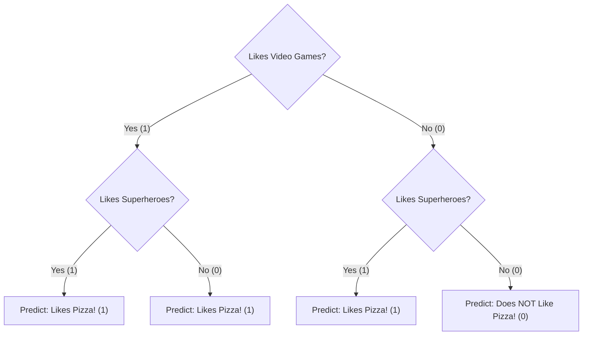

# Lesson 5: Your First AI Model - The Super-Smart Flowchart! 🌳

Welcome back, future AI architect!

This is the moment we've been building up to. We've learned what AI is, how machines learn, and how to prepare our data. Today, we're going to combine all that knowledge and build our very first *real* machine learning model using code!

Don't worry, we're going to start with a model that's super intuitive and easy to understand: the **Decision Tree**.

---

### Part 1: What is a Decision Tree? (A "20 Questions" Game)

A Decision Tree is basically a flowchart that the computer learns all by itself. It's like playing a game of "20 Questions." You ask a series of yes/no questions to narrow down the possibilities and arrive at a final answer.

Imagine you're trying to guess an animal. You might ask:
*   "Does it live in the water?" (No)
*   "Does it have four legs?" (Yes)
*   "Does it bark?" (Yes)
*   "It must be a dog!"

A Decision Tree does the exact same thing with data! It learns the best questions to ask to separate the data into different groups.

> **🧠 How You Decide What to Eat**
>
> Your brain uses a decision tree every day! When you're hungry, you might think: "Am I in the mood for something sweet or savory?" If savory, "Do I want something quick or a full meal?" If quick, "Maybe a sandwich." You're following the branches of your own mental flowchart to make a decision!

---

### Part 2: Building the Tree (From Data to Flowchart)

Let's go back to our trusty pizza-lover dataset. Remember, we encoded it into numbers:

| Likes Video Games? | Likes Superheroes? | Likes Pizza? |
|---|---|---|
| 1 | 1 | 1 |
| 0 | 1 | 1 |
| 1 | 0 | 1 |
| 0 | 0 | 0 |

A Decision Tree model would look at this data and figure out the best question to ask first. It might learn that asking "Likes Video Games?" is a good starting point. It then splits the data into two groups based on the answer. It continues asking questions until it has sorted all the students.

The result is a flowchart that the computer builds automatically. It might look something like this:



This is the "brain" of our model! It's a set of rules the computer has learned from the data.

---

### Part 3: Making a Prediction (Following the Branches)

Now, let's use our tree to predict if a new student, Frank, will like pizza.

*   **Frank's Data:** He likes video games (`1`), but not superheroes (`0`).

We start at the top of the tree:
1.  **Likes Video Games?** Frank's answer is **Yes**. We follow the "Yes" branch.
2.  **Likes Superheroes?** Frank's answer is **No**. We follow the "No" branch.
3.  **Final Answer:** We land on a prediction: **Likes Pizza!**

It's that simple! We just followed the path down the tree to get our answer.

---

### Part 4: The "Code" Part (Python & Scikit-learn)

Okay, it's time. How do we actually tell a computer to do this? We use a programming language, and the most popular one for AI is **Python**.

But we don't have to build everything from scratch! We can use a special "toolbox" for machine learning called **scikit-learn**. It's a free library that has all the common ML models, including Decision Trees, ready to go.

> **🤯 Fun Fact: Built by Volunteers!**
>
> Scikit-learn, one of the most important and powerful AI toolboxes in the world, is built and maintained almost entirely by volunteers! It's a global community of people who are passionate about making machine learning accessible to everyone.

Here’s what the code would look like. Don't worry about understanding every single word. Just focus on the three main steps and the comments that explain them.

```python
# Step 1: Prepare the data (just like we did in Lesson 4!)
# X is our features (the clues), y is our label (the answer)
X = [[1, 1], [0, 1], [1, 0], [0, 0]]  # [Likes Games, Likes Heroes]
y = [1, 1, 1, 0]                     # Likes Pizza (1=Yes, 0=No)

# Step 2: Create and train the model
# We'll import the Decision Tree model from our scikit-learn toolbox
from sklearn.tree import DecisionTreeClassifier

# Create a new, empty Decision Tree model
my_model = DecisionTreeClassifier()

# This is the magic "learning" step!
# We tell the model to "fit" itself to our data.
my_model.fit(X, y)

# Step 3: Make a prediction for a new student
# Let's test it on Frank, who likes games (1) but not heroes (0)
frank = [[1, 0]]
prediction = my_model.predict(frank)

# See the result!
if prediction == 1:
    print("The model predicts Frank will like pizza!")
else:
    print("The model predicts Frank will NOT like pizza.")

# The output will be: The model predicts Frank will like pizza!
```

#### A Closer Look: What Do `.fit()` and `.predict()` Actually Do?

Those two lines of code, `my_model.fit(X, y)` and `my_model.predict(frank)`, are the heart of the whole process. Let's use an analogy to understand them better.

*   **`.fit(X, y)` is for FORGING THE KEY 🔑**
    This is the "study" or "training" phase. Think of it like a locksmith studying a lock (the `y` labels) and the original key (`X` features). The locksmith looks at all the bumps and grooves to understand the pattern. `fit` is the moment the computer does the same thing with our data. It looks at our features and labels and **builds the Decision Tree flowchart**. Before `.fit()`, `my_model` is just an empty shell. After `.fit()`, it's a fully trained model that has forged a "key" based on the patterns in the data.

*   **`.predict(new_data)` is for UNLOCKING THE DOOR 🚪**
    This is the "doing" or "testing" phase. Now you have a new door (`frank`'s data), but you don't know what's behind it. You take the key you just forged (`my_model`) and use it on the new lock. `.predict()` is the action of turning the key. The result—whether the door opens or not—is your prediction!

---

### Part 5: Let's Discuss!

1.  Think about how you decide what to wear in the morning. What "decision tree" do you use? (e.g., Is it cold? -> Yes -> Wear a jacket).
2.  Our tree is very simple. What could go wrong if we used it to predict for *all* new students? (Hint: Think about Grace from Lesson 1).
3.  Does the code seem more or less complicated than you expected? What part is the most surprising?

---

**What's Next?**

**CONGRATULATIONS!** You have officially learned how to build and train your very first AI model. You've taken data, chosen a model, trained it, and used it to make a prediction. This is the core of what machine learning is all about.

From here, you can explore other types of models, learn how to handle much bigger datasets, and even figure out how to measure if your model is any good. The journey is just beginning!

You are no longer just a student of AI—you are a builder. Stay curious!