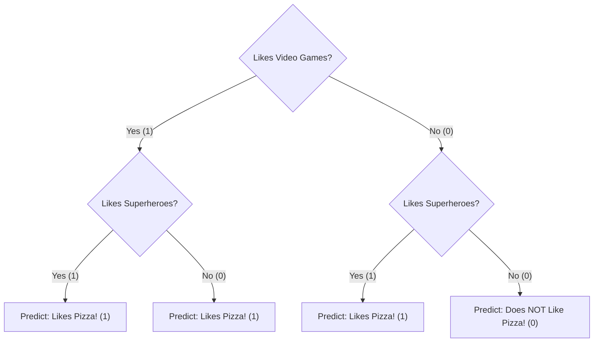
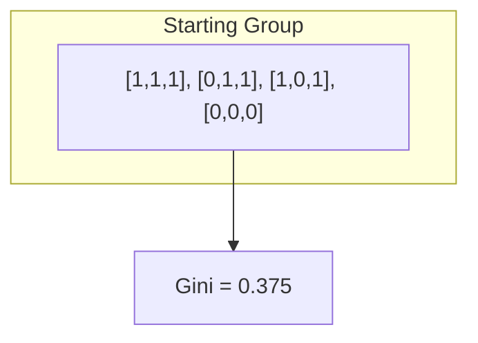
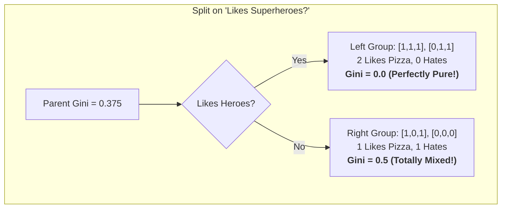

# Lesson 6: Under the Hood - Building a Decision Tree by Hand! 🛠️

Welcome back, AI builder!

In our last lesson, we used the power of `scikit-learn` to build a Decision Tree model in just a few lines of code. It felt a bit like magic, right? You call `.fit()` and suddenly the computer has "learned."

Today, we're going to become the magicians. We're going to pull back the curtain and see what's happening inside that `.fit()` method. We'll build our very own Decision Tree from scratch using nothing but basic Python.

---

### Part 1: From Flowchart to Code

Let's look at our Decision Tree flowchart from the last lesson one more time.



This flowchart is just a set of rules. We can read it like a story: "First, ask if the student likes video games. If the answer is yes, then ask if they like superheroes..." and so on.

We can translate this *exact* story into Python using `if/else` statements.

---

### Part 2: The "Rules" in Python

Let's create our own prediction function called `predict_pizza_by_hand`. This function will take a student's data as a list (e.g., `[1, 0]`) and follow our rules.

The first element in the list (`student[0]`) will be "Likes Video Games?", and the second element (`student[1]`) will be "Likes Superheroes?".

```python
def predict_pizza_by_hand(student):
    # The first question in our flowchart
    if student[0] == 1:  # Do they like video games?
        # If YES, we go down the left side of the tree.
        # Now we ask the second question.
        if student[1] == 1:  # Do they also like superheroes?
            return "Likes Pizza!"
        else:  # They don't like superheroes.
            return "Likes Pizza!"
    else:  # They do NOT like video games.
        # If NO, we go down the right side of the tree.
        # Now we ask the second question.
        if student[1] == 1:  # Do they like superheroes?
            return "Likes Pizza!"
        else:  # They don't like superheroes either.
            return "Does NOT Like Pizza!"

```

Look at that! The `if/else` statements are a perfect mirror of the branches in our flowchart. We've just manually coded the "brain" of our Decision Tree.

---

### Part 3: Putting It All Together

Now let's use our hand-built model to make a prediction, just like we did in the last lesson.

```python
# This is our hand-built model!
def predict_pizza_by_hand(student):
    if student[0] == 1:
        if student[1] == 1:
            return "Likes Pizza!"
        else:
            return "Likes Pizza!"
    else:
        if student[1] == 1:
            return "Likes Pizza!"
        else:
            return "Does NOT Like Pizza!"

# Let's test it on Frank, who likes games (1) but not heroes (0)
frank = [1, 0]
prediction = predict_pizza_by_hand(frank)

# See the result!
print("Our hand-built model predicts Frank:", prediction)

# Let's test it on David, who doesn't like games (0) or heroes (0)
david = [0, 0]
prediction = predict_pizza_by_hand(david)
print("Our hand-built model predicts David:", prediction)

# The output will be:
# Our hand-built model predicts Frank: Likes Pizza!
# Our hand-built model predicts David: Does NOT Like Pizza!
```

It works perfectly! We have successfully created a machine learning model from scratch that can make predictions based on our specific rules.

---

### Part 4: The "Aha!" Moment - Why We Use Toolboxes

This is great, but you might be thinking: "If we can do this by hand, why do we need `scikit-learn`?"

That's the most important question!

Our hand-built model is **not learning**. We looked at the data and *we* decided what the rules should be. We hard-coded the `if/else` statements ourselves. If we got new data, our model wouldn't change.

The magic of `scikit-learn`'s `.fit()` method is that it does all of this for us! It looks at the data and **automatically discovers the best `if/else` rules to use**. It figures out the best questions to ask and in what order to make the most accurate predictions.

If our data had 100 features, we would go crazy trying to write all the `if/else` statements by hand. But `.fit()` can figure it out in a fraction of a second.

So, by building a model by hand, you've learned the secret of what a Decision Tree really is: it's just a smart set of `if/else` rules. And now you can truly appreciate why toolboxes like `scikit-learn` are so powerful—they are masters at finding those rules for us.

---

### Part 5: Building a *Real* Learning Algorithm

**The Challenge:** Welcome to the deep end of the pool! The rest of this lesson is a challenge. It's a peek into how a *real* learning algorithm works. It uses some more advanced ideas, but if you take it slow, you'll be able to see the real magic behind machine learning. Don't worry if you don't get it all on the first try—the goal is to see how it's done!

#### **Tool 1: Recursion (The Endless Mirror)**
Imagine you're standing between two mirrors. You see a reflection of a reflection of a reflection... forever! That's **recursion**. In programming, it's a function that calls *itself* to solve a smaller piece of the same problem. We'll use this to "grow" our tree, with each branch being a smaller version of the tree.

#### **Tool 2: Data Structures (The Tree's Blueprint)**
How do we store a tree in code? We can use a **class**! A `class` is like a blueprint for creating objects. We'll create a `Node` class that acts as a blueprint for each question (or "node") in our tree. Each `Node` object will know what its question is, and what its "left" and "right" branches are.

#### **Tool 3: Gini Impurity (The "Purity" Score)**
This is the secret sauce. How does the algorithm know which question is best? It uses a "purity score" to check how well a question splits the data.

*   A **perfectly pure** group has a score of **0** (e.g., a group of students who all like pizza).

*   A **totally mixed** group has a score of **0.5** (e.g., a group with 50% pizza lovers and 50% pizza haters).

The algorithm calculates the purity score for every possible question and picks the one that creates the purest groups.

> **🤯 Fun Fact: It's All About Information!**
>
> The idea of "Information Gain" (which we get by lowering the Gini Impurity) was developed by a scientist named Claude Shannon, who is considered the "father of the information age." He created a whole field of science called "Information Theory" to measure information, and it's the foundation for how computers, phones, and the internet work today!

#### **The Code, Step-by-Step: A Visual Walkthrough**
Let's trace the computer's "thinking" as it starts to build the tree.

**Input:** Our full dataset of 4 students.
```
[[1, 1, 1],
 [0, 1, 1],
 [1, 0, 1],
 [0, 0, 0]]
```
The computer's first goal is to find the single best question to ask to split this group.

**Step 1: Calculate the Starting Purity**
First, the computer looks at the whole group. There are 3 pizza lovers (1) and 1 hater (0). This is a pretty mixed group.

*   **Computation:** The Gini Impurity for a set S with C classes is defined as:

$$
\mathrm{Gini}(S) = 1 - \sum_{k=1}^{C} p_k^2
$$

where \(p_k\) is the proportion of samples in S that belong to class \(k\).

In our dataset (two classes: pizza=1, not-pizza=0):

$$
p_1 = \frac{3}{4}, \quad p_0 = \frac{1}{4}.
$$

Substitute and compute:

$$
\begin{aligned}
\mathrm{Gini}(S)
    &= 1 - \left(\left(\frac{3}{4}\right)^2 + \left(\frac{1}{4}\right)^2 \right) \\
    &= 1 - \left(\frac{9}{16} + \frac{1}{16}\right) \\
    &= 1 - \frac{10}{16} = \frac{6}{16} = 0.375.
\end{aligned}
$$

Interpretation:

* 0 means perfectly "pure" (all samples same class).

* For binary classification, the maximum Gini is $1 - \tfrac{1}{2} = 0.5$ (when classes are equally mixed).

* Another useful interpretation: \(\sum_k p_k^2\) is the probability that two randomly selected samples from S have the same label; therefore \(\mathrm{Gini}(S)\) equals the probability two randomly chosen samples have different labels, i.e., how "impure" the set is.

*   **Output:** The starting "impurity" is 0.375. The goal is to ask a question that lowers this number as much as possible.



**Step 2: Test the First Question ("Likes Video Games?")**
The computer pretends to split the group based on this question.


*   **Computation:** For a split, we compute the weighted impurity and the information gain. Formally, with \(N\) total samples, \(N_l\) left and \(N_r\) right:

$$
\mathrm{Gini}_{\text{split}} = \frac{N_l}{N}\,\mathrm{Gini}(S_l) + \frac{N_r}{N}\,\mathrm{Gini}(S_r),
$$

where \(S_l\) and \(S_r\) are the left and right subsets after the split.

$$
\mathrm{Information\ Gain} = \mathrm{Gini}(S) - \mathrm{Gini}_{\text{split}}.
$$

In our split "Likes Video Games?":

* Left group (Yes): 2 samples, both like pizza \(\Rightarrow\) \(\mathrm{Gini}(S_l) = 0\) (pure).

* Right group (No): 2 samples, 1 likes, 1 does not \(\Rightarrow\) \(p=1/2,\,\mathrm{Gini}(S_r) = 1 - (1/2)^2 - (1/2)^2 = 0.5\).

* Weighted impurity:

$$
\mathrm{Gini}_{\text{split}} = \frac{2}{4}\cdot 0 + \frac{2}{4}\cdot 0.5 = 0.25.
$$

* Information Gain:

$$
\mathrm{Information\ Gain} = 0.375 - 0.25 = 0.125.
$$

*   **Output:** The score for this question is \(0.125\).

**Step 3: Test the Second Question ("Likes Superheroes?")**
Now the computer "forgets" the last split and tries again with the next question.



*   **Computation:** This yields the same numeric result by symmetry, so its information gain is also \(0.125\).

*   **Output:** The score for this question is \(0.125\).

**Step 4: The Decision**
The computer compares the scores. In this case, they're tied! In a tie, the computer just picks the first one it tried.

*   **The Winner:** The best first question is "Likes Video Games?".

**Step 5: The Recursion**
The computer now has the root of its tree! It then repeats this *entire process* on the smaller groups.

1.  It runs the `get_best_split` logic on the "Yes" group.

2.  It runs the `get_best_split` logic on the "No" group.

This is the "endless mirror" of recursion in action! It continues until the groups are pure.

> **🧠 How Experts Think**
>
> This process of finding the best question is similar to how an expert, like a doctor, diagnoses an illness. They don't ask random questions. They ask the one question that gives them the most information to narrow down the possibilities. A doctor who asks, "Do you have a fever?" is making a "split" that provides a high "information gain." The AI is learning to think like an expert!

#### **The Full Code: A Real Decision Tree**
This code puts all those ideas together. It's complex, but now you can see the "thinking" that happens inside it.

```python
import numpy as np

# A class to represent a single node in our decision tree
class Node:
    def __init__(self, feature_index=None, threshold=None, left=None, right=None, info_gain=None, value=None):
        self.feature_index = feature_index
        self.threshold = threshold
        self.left = left
        self.right = right
        self.info_gain = info_gain
        self.value = value

# The main Decision Tree class
class MyDecisionTree:
    def __init__(self, min_samples_split=2, max_depth=2):
        self.root = None
        self.min_samples_split = min_samples_split
        self.max_depth = max_depth

    def build_tree(self, dataset, curr_depth=0):
        X, Y = dataset[:,:-1], dataset[:,-1]
        num_samples, num_features = np.shape(X)

        if num_samples >= self.min_samples_split and curr_depth <= self.max_depth:
            best_split = self.get_best_split(dataset, num_samples, num_features)
            if best_split["info_gain"] > 0:
                left_subtree = self.build_tree(best_split["dataset_left"], curr_depth + 1)
                right_subtree = self.build_tree(best_split["dataset_right"], curr_depth + 1)
                return Node(best_split["feature_index"], best_split["threshold"],
                            left_subtree, right_subtree, best_split["info_gain"])

        leaf_value = self.calculate_leaf_value(Y)
        return Node(value=leaf_value)

    def get_best_split(self, dataset, num_samples, num_features):
        best_split = {}
        max_info_gain = -float("inf")

        for feature_index in range(num_features):
            feature_values = dataset[:, feature_index]
            possible_thresholds = np.unique(feature_values)
            for threshold in possible_thresholds:
                dataset_left, dataset_right = self.split(dataset, feature_index, threshold)
                if len(dataset_left) > 0 and len(dataset_right) > 0:
                    y, left_y, right_y = dataset[:, -1], dataset_left[:, -1], dataset_right[:, -1]
                    curr_info_gain = self.information_gain(y, left_y, right_y)
                    if curr_info_gain > max_info_gain:
                        best_split["feature_index"] = feature_index
                        best_split["threshold"] = threshold
                        best_split["dataset_left"] = dataset_left
                        best_split["dataset_right"] = dataset_right
                        best_split["info_gain"] = curr_info_gain
                        max_info_gain = curr_info_gain
        return best_split

    def split(self, dataset, feature_index, threshold):
        dataset_left = np.array([row for row in dataset if row[feature_index] <= threshold])
        dataset_right = np.array([row for row in dataset if row[feature_index] > threshold])
        return dataset_left, dataset_right

    def information_gain(self, parent, l_child, r_child):
        weight_l = len(l_child) / len(parent)
        weight_r = len(r_child) / len(parent)
        gain = self.gini_impurity(parent) - (weight_l * self.gini_impurity(l_child) + weight_r * self.gini_impurity(r_child))
        return gain

    def gini_impurity(self, y):
        class_labels = np.unique(y)
        gini = 0
        for cls in class_labels:
            p_cls = len(y[y == cls]) / len(y)
            gini += p_cls**2
        return 1 - gini

    def calculate_leaf_value(self, Y):
        Y = list(Y)
        return max(Y, key=Y.count)

    def fit(self, X, Y):
        dataset = np.concatenate((X, Y), axis=1)
        self.root = self.build_tree(dataset)

    def predict(self, X):
        predictions = [self.make_prediction(x, self.root) for x in X]
        return predictions

    def make_prediction(self, x, tree):
        if tree.value != None: return tree.value
        feature_val = x[tree.feature_index]
        if feature_val <= tree.threshold:
            return self.make_prediction(x, tree.left)
        else:
            return self.make_prediction(x, tree.right)

# Let's use it!
X = np.array([[1, 1], [0, 1], [1, 0], [0, 0]])
Y = np.array([[1], [1], [1], [0]])

my_tree = MyDecisionTree(min_samples_split=2, max_depth=2)
my_tree.fit(X, Y)

frank = [[1, 0]]
prediction = my_tree.predict(frank)
print("Our REAL hand-built model predicts Frank's result is:", prediction)
```

---

### Part 6: Let's Discuss!

1.  What do you think is the biggest advantage of using a library like `scikit-learn` now that you've seen the complexity behind it?
2.  Our Gini Impurity calculation was simple for our small dataset. How would this process change for a dataset with millions of rows?
3.  Does seeing the "from scratch" version make the `scikit-learn` code from Lesson 5 make more sense?

---

**What's Next?**

This is the end of our introductory journey, but it's just the beginning of your adventure in AI.

You have learned:
*   What AI, ML, and DL are.
*   The different ways machines can learn.
*   How to prepare data for a computer.
*   How to build a model with a powerful toolbox.
*   And now, you've even built a real learning algorithm from scratch!

You have a stronger foundation in machine learning than most people on the planet. The next step is to keep building. Keep asking questions. And most importantly, stay curious!