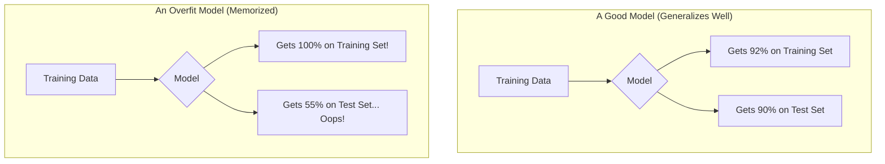

# Lesson 7: Is Our AI Smart? - Grading Your Model 📝

Welcome back, AI builder!

In our last two lessons, we did something amazing: we built a Decision Tree model, both with a powerful toolbox and from scratch! We have a working model. But that leads to the most important question a data scientist can ask: **Is our model actually any good?**

Today, we're going to learn how to be a good scientist and grade our own model. We'll find out if our AI is a real genius or just a good guesser.

---

### Part 1: The Problem with "Cheating"

Imagine you're studying for a big history test. Your teacher gives you a study guide with 20 questions on it. You study those 20 questions until you know them by heart.

Then, you get to the test, and the teacher gives you the *exact same 20 questions* from the study guide. You'd get 100%, right? But did you actually *learn* history, or did you just *memorize* the answers to those specific questions?

This is the problem we have in machine learning. If we test our model on the same data it trained on, it might get a perfect score. But that doesn't mean it has learned the real patterns. It might have just memorized the "answers" in the training data.

---

### Part 2: The Solution - The "Test Set"

To solve this, we do something very simple and very powerful: we split our data into two piles *before* we start.

1.  **The Training Set (The Study Guide):** This is the bigger pile, usually about 80% of our data. We give this to our model to learn from. This is its homework, its notes, its study guide.

2.  **The Test Set (The Final Exam):** This is the smaller pile, the other 20%. We **hide** this data from the model while it's training. The model never, ever gets to see the answers for the test set.

Once the model is fully trained on the training set, we bring out the test set and use it to give the model its final grade. This gives us an honest look at how well our model can perform on new data it has never seen before.

---

### Part 3: The "Overfitting" Trap

The "cheating" problem we talked about has a fancy name in machine learning: **overfitting**.

Overfitting happens when a model doesn't learn the general patterns in the data, but instead starts to memorize the noisy, random details of the training set. It's like a student who memorizes that "Question 3's answer is B" instead of learning the actual history behind the question.

An overfit model will look like a genius on the training data, but it will fail miserably on the test data.



A good model might not get a perfect score on the training data, but its score on the test data will be very close. That's how we know it has learned the real patterns!

---

### Part 4: The Code - Splitting and Scoring

So how do we do this in code? `scikit-learn` makes it incredibly easy!

1.  **`train_test_split`:** This function automatically shuffles and splits our data into training and testing sets.
2.  **`.score()`:** After training, we can use this method on our model to see its grade (its accuracy) on the test set.

Let's see it in action:

```python
from sklearn.tree import DecisionTreeClassifier
from sklearn.model_selection import train_test_split # Our new tool!

# Step 1: Prepare the data
# Let's imagine we have more data this time
X = [[1, 1], [0, 1], [1, 0], [0, 0], [1, 1], [0, 1], [1, 0], [0, 0], [1, 1], [0, 0]]
y = [1, 1, 1, 0, 1, 1, 1, 0, 1, 0]

# Step 2: Split the data into a training set and a test set
# test_size=0.2 means we'll save 20% of the data for the final exam
X_train, X_test, y_train, y_test = train_test_split(X, y, test_size=0.2, random_state=42)

# Step 3: Create and train the model (ONLY on the training set!)
my_model = DecisionTreeClassifier()
my_model.fit(X_train, y_train)

# Step 4: Grade the model on the unseen test set
accuracy = my_model.score(X_test, y_test)

print("The model's accuracy on the final exam is:", accuracy)

# The output might be: The model's accuracy on the final exam is: 1.0 (which is 100%!)
# In this case, our model got a perfect score on the two questions in our test set.
```

---

### Part 5: Is Accuracy Always the Best Grade?

For our pizza problem, getting a grade of 90% (an accuracy of `0.9`) sounds great! But is accuracy always the best way to grade a model?

**The Analogy: The Rare Disease Detector**
Imagine you build an AI to detect a very rare disease that only 1 out of 100 people has.

A lazy, useless model could just predict **"no disease"** for every single person. Think about its accuracy. It would be correct for the 99 people who don't have the disease, and wrong for the 1 person who does. Its accuracy would be **99%**!

It got an A+ grade, but it's a terrible model because it never finds the one person who actually needs help.

In cases like this, scientists use other metrics like **Precision** (of all the patients the model said were sick, how many actually were?) and **Recall** (of all the patients who were really sick, how many did the model find?).

> **🧠 Different Kinds of "Correct"**
>
> This is true in life, too! Getting a 99% on a test is great. But if a smoke detector works 99% of the time, that 1% of the time it fails could be disastrous. Sometimes, certain kinds of mistakes are much worse than others. Grading an AI is about understanding which mistakes are the most important to avoid.

---

### Part 6: Let's Discuss!

1.  Why should you never, ever train your model on your test data?
2.  If a model gets 100% on the training set but only 50% on the test set, what problem is it suffering from?
3.  Can you think of another example (besides the disease detector) where a high accuracy score might be misleading?

---

**What's Next?**

This is the end of our introductory series, and you have been an amazing student!

You have learned:

*   What AI, ML, and DL are.

*   The different ways machines can learn.

*   How to prepare data for a computer.

*   How to build a model with a powerful toolbox.

*   How to peek under the hood to see how it all works.

*   And now, how to properly grade your work like a real scientist.

You have a stronger foundation in machine learning than most people on the planet. The journey from here is endless and exciting. You can explore new models, work with bigger and more interesting datasets, and start building projects that can help people.

The most important thing is to never stop learning. Stay curious!