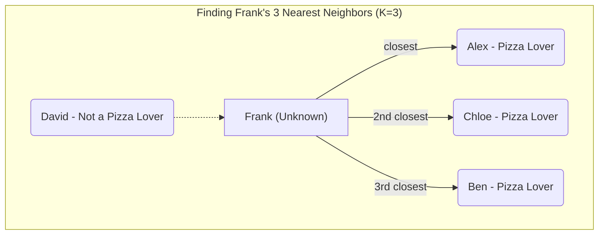

# Lesson 8: You Are Who Your Friends Are - K-Nearest Neighbors 🧑‍🤝‍🧑

Welcome back, AI explorer!

You've learned how to build and evaluate a Decision Tree, which is a model that learns by creating a set of `if/else` rules. But that's not the only way a machine can learn!

Today, we're going to learn about a completely different and wonderfully simple algorithm called **K-Nearest Neighbors (KNN)**. Its core idea is something you already understand from everyday life: you can tell a lot about someone by the company they keep.

---

### Part 1: The Big Idea (The "Friend Group" Analogy)

Imagine it's your first day at a new school. You see a student you don't know, and you want to guess if they like playing soccer. You look around and see them talking and laughing with three other students. You know all three of those students are on the school's soccer team.

What's your prediction? You'd probably guess the new student likes soccer, too!

You just used the K-Nearest Neighbors algorithm. The logic is simple: **to predict something about a new data point, first find its "K" closest neighbors, then have them vote.**

---

### Part 2: Finding the "Nearest" Neighbors

For a computer, "closest" doesn't mean sitting next to someone at lunch. It means the distance on a graph. Let's imagine we have a graph where one axis is "Likes Video Games" and the other is "Likes Superheroes." We can plot all our students on this graph.

Now, a new student, "Frank," comes along. We can plot him on the graph, too. To find his nearest neighbors, the computer simply measures the distance to all the other points.

Let's say we choose **K=3**. The algorithm will find the 3 students who are closest to Frank on the graph.


In this case, Frank's three closest "friends" on the graph are Alex, Chloe, and Ben. David is too "far away" to be in his group of K=3.

---

### Part 3: Making a Prediction (Majority Vote)

Once we have our K-nearest neighbors, making a prediction for classification is easy: **it's a majority vote!**

1.  **Look at the neighbors' labels:**
    *   Alex: Likes Pizza

    *   Chloe: Likes Pizza

    *   Ben: Likes Pizza

2.  **Count the votes:** That's 3 votes for "Likes Pizza" and 0 votes for "Doesn't Like Pizza."

3.  **Make the prediction:** The majority wins! We predict that Frank will like pizza.

It's that intuitive!

> **🧠 The Power of Social Influence**
>
> KNN is a mathematical version of a powerful psychological principle called "social proof." We often decide what to do or what to like based on the people around us. If you see a long line outside an ice cream shop, you assume the ice cream must be good. The KNN algorithm uses the same logic: if all the "neighboring" data points have a certain label, the new point probably has that label too.

---

### Part 4: What About Regression? (Averaging the Friends)

KNN is amazing because it can do regression, too! But instead of a vote, it takes an **average**.

Let's say we want to predict a new student's score on a math test.

1.  We find the **K=3** closest neighbors (the students who have similar study habits, maybe).

2.  We look at their test scores: Student A got a 90, Student B got a 95, and Student C got an 88.

3.  Instead of voting, we **average** their scores: `(90 + 95 + 88) / 3 = 91`.

4.  Our prediction for the new student's test score is a 91!

So, for KNN:

*   **Classification** = Majority Vote

*   **Regression** = Average

---

### Part 5: The Code - KNN in Scikit-learn

Here's the best part. Because `scikit-learn` is so well-designed, swapping our Decision Tree for a KNN model is incredibly easy. The code is almost identical!

```python
from sklearn.neighbors import KNeighborsClassifier # We just import a different tool!
from sklearn.model_selection import train_test_split

# Step 1: Prepare the data (same as before)
X = [[1, 1], [0, 1], [1, 0], [0, 0], [1, 1], [0, 1], [1, 0], [0, 0], [1, 1], [0, 0]]
y = [1, 1, 1, 0, 1, 1, 1, 0, 1, 0]

# Step 2: Split the data (same as before)
X_train, X_test, y_train, y_test = train_test_split(X, y, test_size=0.2, random_state=42)

# Step 3: Create and train the model
# Instead of DecisionTreeClassifier, we use KNeighborsClassifier!
# We'll tell it to use 3 neighbors (K=3).
my_model = KNeighborsClassifier(n_neighbors=3)
my_model.fit(X_train, y_train) # The .fit() method works the same way!

# Step 4: Grade the model (same as before)
accuracy = my_model.score(X_test, y_test)

print("The KNN model's accuracy on the final exam is:", accuracy)
```

This shows the power of a good library. Once you know the workflow (split, fit, score), you can easily experiment with different types of models!

---

### Part 6: Let's Discuss!

1.  In our example, we used K=3. What might happen if we set K=1? What could be a potential problem with that?
2.  What might happen if our dataset had 100 students and we set K=100?
3.  Can you think of a time in real life when you used "nearest neighbors" logic to make a decision or a guess about something?

---

**What's Next?**

Congratulations! You've added another powerful algorithm to your machine learning toolkit. You're seeing that there are many different ways to teach a machine, each with its own logic.

This lesson concludes our initial journey into the world of specific ML algorithms. From here, the world is your oyster. You can explore more complex models like Neural Networks, dive deeper into Deep Learning, or start working on your own projects with real-world data.

You have learned an incredible amount. Never stop being curious, and never stop building!